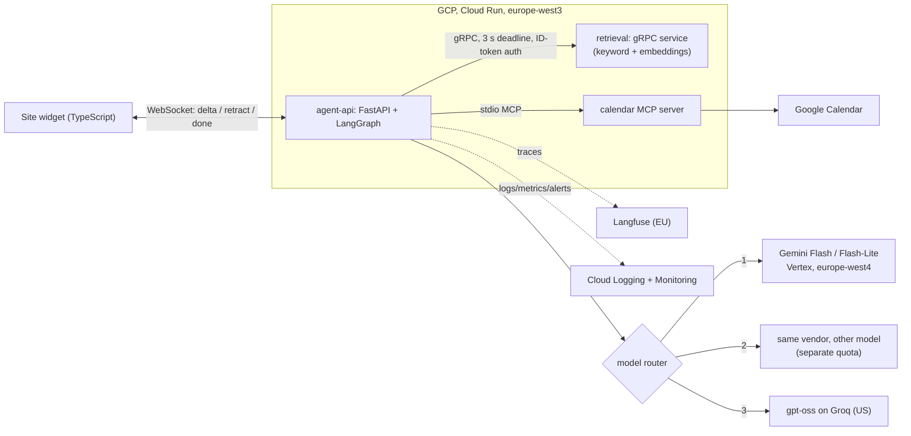

# Twin: an operated agent for ducanhvalentinonguyen.com

A chat assistant ("Hi, I'm Duc-Anh's twin") that answers questions about Duc-Anh from his portfolio site,
cites the section it used (and scrolls the page to it), and can book a call on his Google Calendar. Built in
three days as a hackathon to show the whole loop: agent, tools, evaluation, deployment, operations.

Try it: <https://ducanhvalentinonguyen.com/?twin=1>



Graph: `classify` -> (`retrieve` | **research**: `plan` -> parallel `research` x N -> `reflect` -> one more round if gaps) ->
`answer` (streamed) -> `verify` (experimental, off) -> `finalize` (citations validated against what was retrieved).
Booking and message branches collect details, propose, **`interrupt()` until the visitor confirms**, then act.

## What is built (and tested)

| Area | Implementation | Evidence |
|---|---|---|
| Orchestration | LangGraph: routing, **research mode** (plan, parallel `Send` fan-out, reflect loop), human-confirmation `interrupt()`, structured outputs with a strong-model retry | 24 unit tests, `docs/experiment.md` |
| Multi-step reasoning | complex questions are split, searched in parallel, checked for gaps and re-searched; each step streams to the chat | evidence recall +0.05 to +0.125 over plain RAG across two runs (second run's 95% CI just touches zero) |
| Tool use / MCP | FastMCP server over stdio (calendar + send-mail tools), discovered via `langchain-mcp-adapters` | live booking and live message tested |
| Booking and messages | confirm-before-act, deterministic event id, 409 reconciliation, **3 half-hour slots per visitor as separate calls or one longer meeting, extend afterwards**, Wed/Fri block, durable daily caps, no auto-retry on send | 35 booking tests incl. real-chat replays; INC-008 |
| Voice input | push-to-talk, recorded in the browser, transcribed by Gemini in the EU through our server; never stored or traced; 20-clip accuracy study | WER 11.5%, [docs/voice.md](docs/voice.md) |
| Retrieval | separate gRPC service, Vertex embeddings + BM25, deadline + in-process fallback | 4 gRPC tests |
| Streaming | WebSocket `delta` / `retract` / `step` / `choices` / `done`; reconnect resends the same turn id (replayed, never re-run) | |
| Routing and failure | tiered router, circuit breaker, TTFT timeout, 429 retry + cooldown, 3 providers on 2 vendors, retrieval-only degraded mode, truncation guard | INC-001, 002, 004 |
| Persistence | Firestore: turns, audit, durable counters; TTL (30 days) and a composite index in Terraform | `docs/SCHEMA.md` |
| Online scoring | thumbs in the widget, LLM judge as a scheduled Cloud Run Job, scores on the Langfuse trace | judged a live turn |
| Offline evaluation | 36-case adversarial suite (incl. poisoned documents), 40-case fact set, 12 multi-hop cases, paired bootstrap | 2 experiments, 5 incidents written up |
| Observability | Langfuse (one nested trace per turn), JSON logs, 6 log metrics, 6 alert policies, dashboard | |
| Infra / CI | Terraform (services, job, scheduler, Firestore, secrets, IAM, alerts, budget); GitHub Actions CI + manual security gate | |

## Honest status and limits

- **Conversation state** (LangGraph checkpoints, rate limits) is still in memory on one instance: a restart drops
  in-flight conversations. Daily caps, turn history and feedback are durable in Firestore.
- **Not built:** automated deploys from GitHub (deploys are `scripts/deploy.sh`), a local-GPU (RTX 4090) benchmark,
  Cloud Trace / OpenTelemetry (Langfuse is the tracing layer), long-term per-visitor memory.
- **Pending on a human:** the LLM judge is not calibrated against human labels (`evals/calibrate.py`).
- **Negative result:** claim verification gave no benefit and costs about 2 s and 68% more per answer, so it is off.
- **Research mode:** helps retrieval on average but not answer quality (unmeasured), costs more, and cannot fix
  vocabulary gaps (e.g. "private code"). It runs only for questions flagged complex.
- **Occasional related-fact answers:** asked what he did at an organisation the site doesn't mention ("at Google"), it
  sometimes offers a related fact (a competition that company hosted) instead of saying it doesn't know. A prompt rule
  cut this to roughly one answer in three; it is not eliminated.
- **Voice:** push-to-talk with about 2 s delay, weaker in German and on product names; measured on synthetic speech only
  ([docs/voice.md](docs/voice.md)).
- **Free-tier limits shape the design:** the judge has 200k tokens/day (INC-005).
- Booking availability is my assumption (weekdays 10:00-17:00 Berlin, 24 h notice): edit `calendar_mcp.py`.
- Groq is a US vendor used only as a last-resort fallback and for judging; the privacy page says so.

## Run it

The public portfolio serves a versioned widget bundle from its own `/assets/` directory. Its script tag
sets `data-api` to the Cloud Run URL, so the button and greeting can render before the Python backend
starts. A non-blocking health request wakes the backend while the visitor reads; the chat shows its
connection status. The API still serves `/widget.js` for other embeds. Agent Cloud Run scales to zero,
so the first answer can still wait for a cold start.

Visitors can drag the chat's upper-left corner to resize it, or use the expand/restore button to
fill the visible screen. The chosen dimensions are remembered locally and constrained to the
available viewport, including when the phone keyboard opens. The resize control also supports
arrow keys.

After changing the widget, build it and prepare the portfolio update:

```sh
npm run build --prefix widget
python3 scripts/sync_widget.py --site-dir /path/to/portfolio \
  --api https://twin-agent-api-7yjacf5bma-ey.a.run.app
```

Review and publish the portfolio's updated `index.html` and new `assets/twin-widget-*.js` through
GitHub Pages. Backend image deployment alone does not update that static bundle.

```sh
uv sync
cp .env.example .env                      # GROQ_API_KEY, LANGFUSE_*  (Vertex uses ADC)
uv run uvicorn app.main:app --app-dir services/agent-api --port 8090
uv run python evals/run_security.py --url ws://localhost:8090/ws/chat
uv run pytest -q
scripts/deploy.sh v12                     # build, push, terraform apply
```

More: [blueprint](docs/BLUEPRINT.md) · [experiments](docs/experiment.md) · [incidents](docs/incidents/) · [data schema](docs/SCHEMA.md)
